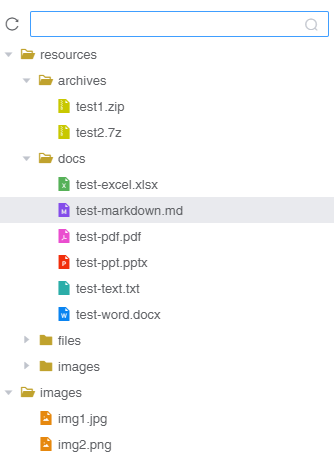

# vue-electron-folder

[vue-electron-folder](https://github.com/TheoXiong/vue-electron-folder) 是一个适用于vue-electron应用的文件夹管理组件

## 目录
- [特性](#特性)
- [演示](#演示)
- [安装](#安装)
- [使用](#使用)
- [API](#API)
- [参考](#参考)

## 特性
- 树形展示文件夹列表
- 支持不同路径下的多个文件夹管理
- 支持单选/多选/拖拽操作
- 支持过滤/搜索文件
- 支持自定义文件图标
- 支持文件移动 [TODO]

## 演示




## 安装
``` 
$   npm install vue-electron-folder --save
```

## 使用

### 引入模块
```
import Folder from 'vue-electron-folder'
```

### 注册
#### 全局注册
```
Vue.use(Folder)
```
#### 组件内注册
```
<script>
export default {
  components: { Folder }
}
</script>
```

### 基础用法
          
示例代码：
```
<template>
  <div class="container">
    <folder :openedFolders="openedFolders"></folder>
  <div>
</template>

<script>
import Folder from 'vue-electron-folder'

export default {
  name: 'DemoComp',
  data () {
    return {
      openedFolders: []
    }
  },
  mounted () {
    this.openedFolders.push('/your/test/folder/path')
  },
  components: { Folder }
}
</script>

<style scoped>
.container{
  height: 500px;
}
</style>
```

### 自定义文件图标    
> 需在项目中引入自定义图标的iconfont     
        
示例代码：
```
<template>
  <div class="container">
    <folder 
      :openedFolders="openedFolders"
      :icons="icons"
    >
    </folder>
  <div>
</template>

<script>
import Folder from 'vue-electron-folder'

export default {
  name: 'DemoComp',
  data () {
    return {
      openedFolders: [],
      icons: {
        '.xlsx': { name: 'iconfile-excel-fill', color: '#56B158' },
        '.docx': { name: 'iconfile-word-fill', color: '#0A84F1' },
        '.pptx': { name: 'iconfile-ppt-fill', color: '#F12E0B' },
        '.zip': { name: 'iconfile-zip-fill', color: '#C8C800' },
        '.7z': { name: 'iconfile-zip-fill', color: '#C8C800' },
        '.pdf': { name: 'iconfile-pdf-fill', color: '#EA4DCF' },
        '.png': { name: 'iconfile-image-fill', color: '#E6880E' },
        '.jpg': { name: 'iconfile-image-fill', color: '#E6880E' },
        '.md': { name: 'iconfile-markdown-fill', color: '#844DEA' },
      }
    }
  },
  mounted () {
    this.openedFolders.push('/your/test/folder/path')
  },
  components: { Folder }
}
</script>

<style scoped>
.container{
  height: 500px;
}
</style>
```

### 调试
组件中提供了简单的调试示例
```
npm install
npm run dev
```

## API

### 属性

参数 | 说明 | 类型 | 可选值 | 默认值 | 示例      
-|-|-|-|-|-|
openedFolders        | 打开的文件夹数组。由外层传入，内部监听数组变更 | Array  | — | [] | ['/home/dir1', '/home/dir2']
checkedFiles         | 勾选的文件         | Array | — | [] | ['/home/dir1/file1', '/home/dir2/file2']
includes             | 只显示指定的文件    | Array | — | [] | ['.js', '.py', '.html', '.css']
icons                | 自定义的文件图标    | Object | — | null | { '.md': { name: 'iconfile-markdown-fill', color: '#844DEA' } }
maxLevel             | 单次最多遍历的文件夹层级数 | Number | — | 3 | -
enableClose          | 是否显示关闭文件夹按钮 | Boolean | — | true | -
enableReload         | 是否显示刷新文件夹按钮 | Boolean | — | true | -
enableReloadAll      | 是否显示刷新所有文件夹按钮 | Boolean | — | true | -
multiSelection       | 是否启用多选功能 | Boolean | — | true | -
multiSelectionBlacklist  | 指定某些文件只能单选  | Array  | — | [] | ['.js', '.cpp']


### 事件

事件名 | 说明 | 回调参数
-|-|-|
click  | 单击文件/文件夹事件 | data
select | 单独选中文件/文件夹事件 | data
multi-select  | 多选事件 | selected
dblclick | 双击文件的事件 | data
close  | 关闭文件夹的事件 | data
drag-start | 开始拖拽的事件 | selectedFiles, event


## 参考
- VS Code
- Element UI

